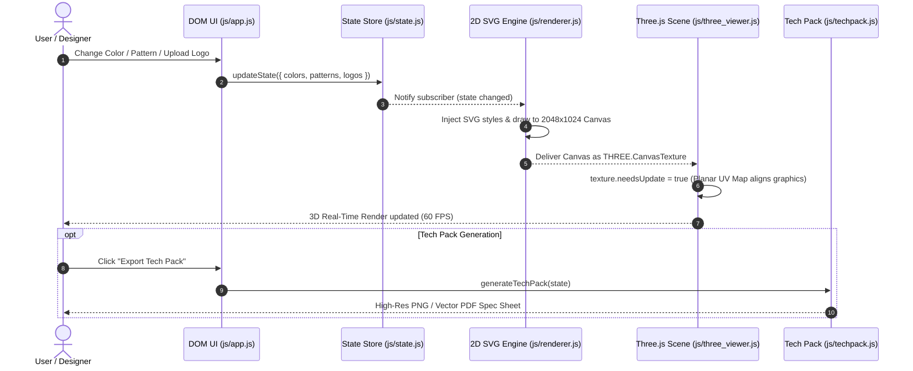

# Repository Atlas & Codemap: MiniJersey 3D Studio

## 📌 Project Overview
**MiniJersey 3D Studio** is an open-source, 100% client-side web application for real-time 2D/3D cycling jersey design, dynamic WebGL texture projection, custom 3D model ingestion, and manufacturing Tech Pack generation.

- **URL:** [https://francescocastaldi.github.io/mini-jersey-studio/](https://francescocastaldi.github.io/mini-jersey-studio/)
- **Repository:** [FrancescoCastaldi/mini-jersey-studio](https://github.com/FrancescoCastaldi/mini-jersey-studio)
- **Tech Stack:** Vanilla ES6+, HTML5 Canvas, SVG Vector Engine, Three.js r128, OrbitControls, GLTFLoader.

---

## 🏛️ System Entry Points & Layout

```text
mini-jersey-studio/
├── index.html                  # Main application shell, UI layout, CDN imports, and SVG templates
├── css/
│   └── style.css               # Glassmorphic UI design tokens, responsive CSS grid/flexbox, toolbars
├── js/
│   ├── app.js                  # Main UI controller & DOM event orchestrator
│   ├── state.js                # Centralized reactive Pub/Sub state store
│   ├── renderer.js             # SVG-to-Canvas 2D texture rasterization engine
│   ├── cycling_model.js        # 3D Pro Cycling Jersey procedural geometry generator
│   ├── three_viewer.js         # Three.js 3D WebGL engine & dynamic planar UV mapper
│   ├── techpack.js             # 2D production blueprint & printable PDF export engine
│   └── model_data.js           # Base64-encoded default 3D model (bypasses browser CORS)
├── img/
│   └── velox_logo.jpg          # Ultra-modern minimal cycling brand logo asset
├── .github/
│   ├── workflows/deploy.yml    # Automated GitHub Pages CI/CD pipeline
│   └── ISSUE_TEMPLATE/         # GitHub issue & PR community health templates
├── robots.txt                  # Search engine crawler directives
├── sitemap.xml                 # Canonical sitemap for SEO indexing
├── CITATION.cff                # Academic citation and software attribution metadata
├── LICENSE                     # MIT License
├── README.md                   # Project documentation, badges, and quickstart guide
├── AGENTS.md                   # AI agent instructions & architectural context
└── SITE_HEALTH_REPORT.md       # Deployment & performance audit report
```

---

## 🗺️ Module Directory Map & Responsibilities

| Module / File | Responsibility | Design Patterns | Key Functions & Exports |
| :--- | :--- | :--- | :--- |
| [`js/cycling_model.js`](file:///c:/Users/franc/Documents/mini-jersey-studio/js/cycling_model.js) | Procedural 3D Pro Cycling Jersey engine (aero race-fit torso, raglan sleeves, aero collar, 3D rear cargo pockets, zipper). | **Builder / Factory** | `CyclingJersey3DBuilder`, `build(textureMap)` |
| [`js/state.js`](file:///c:/Users/franc/Documents/mini-jersey-studio/js/state.js) | Central source of truth for design state (colors, patterns, typography, logos, active camera, undo/redo history). | **Observer / Pub-Sub** | `getState()`, `updateState(key, val)`, `subscribe(fn)`, `undo()`, `redo()` |
| [`js/renderer.js`](file:///c:/Users/franc/Documents/mini-jersey-studio/js/renderer.js) | Clones flat SVG pattern nodes, applies colors/gradients/logos, and rasterizes onto a 2048x1024 HTML5 `<canvas>`. | **Factory / Builder** | `renderTexture(state)`, `bakeSVGToCanvas(svgElement)`, `getTextureCanvas()` |
| [`js/three_viewer.js`](file:///c:/Users/franc/Documents/mini-jersey-studio/js/three_viewer.js) | Three.js WebGL scene lifecycle, lighting, camera controls, custom GLB loader, and Dynamic Planar UV coordinate remapping. | **Facade / Viewport Manager** | `initThree()`, `loadModelByType(type)`, `loadModelFromURL(url)`, `updateTexture(canvas)` |
| [`js/techpack.js`](file:///c:/Users/franc/Documents/mini-jersey-studio/js/techpack.js) | Compiles front/back panels, Pantone/HEX palettes, measurements, and sponsor placements into a 2D production spec sheet. | **Report Generator / Exporter** | `generateTechPack(state)`, `downloadTechPackPNG()`, `downloadTechPackPDF()` |
| [`js/app.js`](file:///c:/Users/franc/Documents/mini-jersey-studio/js/app.js) | Binds all DOM interactions (color pickers, sliders, model upload, camera snaps, preset loader) to state dispatches. | **Mediator / Controller** | `initApp()`, `bindEventListeners()`, `handleModelUpload(file)`, `exportJerseyFile()` |
| [`js/model_data.js`](file:///c:/Users/franc/Documents/mini-jersey-studio/js/model_data.js) | Embedded Base64 Data URI string of default `shirt.glb` to guarantee zero-CORS offline execution (`file:///`). | **Asset Constant** | `window.SHIRT_GLB` |

---

## 🔄 Data & Control Flow



---

## 🔬 Mathematical Planar UV Projection Logic

For any arbitrary imported 3D mesh $\mathcal{M}$ with vertex positions $\mathbf{v} = (x, y, z)$:

1. **Bounding Box Calculation**:
   $$\Delta x = x_{\max} - x_{\min}, \quad \Delta y = y_{\max} - y_{\min}$$
2. **Normalized Coordinates**:
   $$\hat{x} = \frac{x - x_{\min}}{\Delta x}, \quad \hat{y} = \frac{y - y_{\min}}{\Delta y}$$
3. **Dual-Hemisphere Partitioning**:
   $$u = \begin{cases} 
   0.5 \cdot \hat{x} & \text{if } z > 0 \quad (\text{Front Hemisphere}) \\
   0.5 + 0.5 \cdot (1 - \hat{x}) & \text{if } z \le 0 \quad (\text{Back Hemisphere with horizontal inversion})
   \end{cases}$$
   $$v = \hat{y}$$

---

## 🔒 Integration & Portability Constraints
- **Zero Build Step:** Runs directly in any modern browser via standard ES6 scripts.
- **Offline / Local File Protocol (`file:///`):** Supported via Base64 model embedding.
- **Edge Deployment:** Hosted with automated CI/CD on GitHub Pages via `.github/workflows/deploy.yml`.
